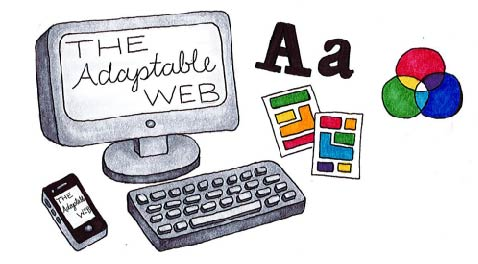
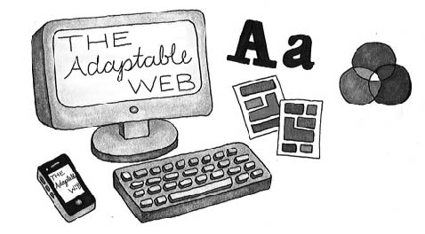
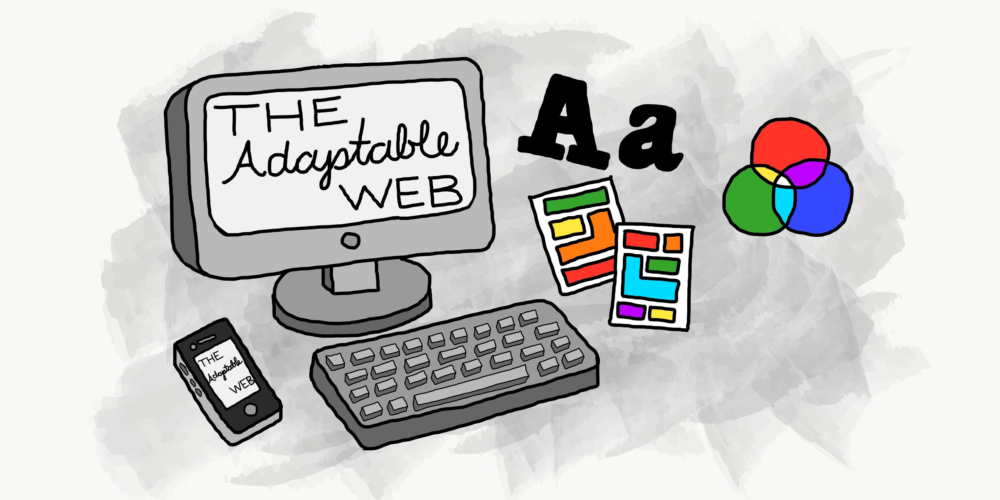
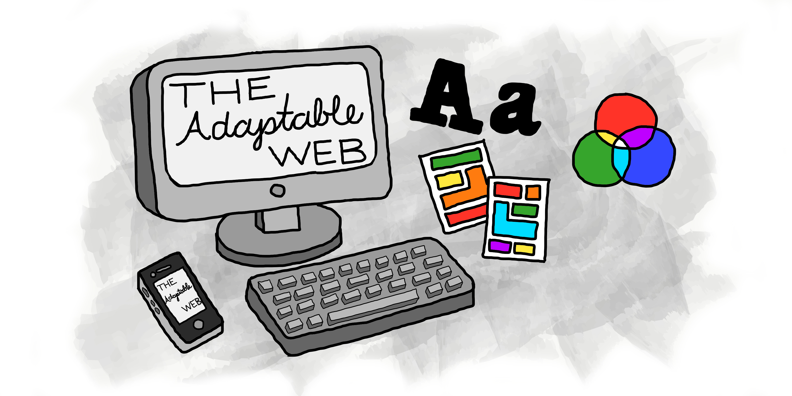
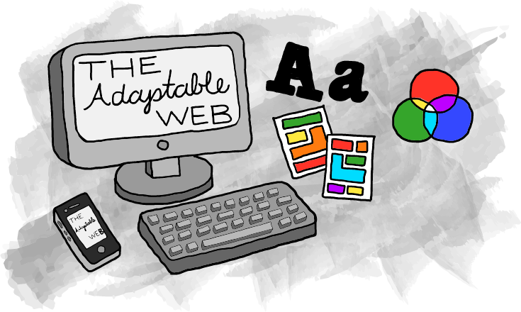

# ebb-flow

>"Write a summary and illustrate an image for the seminal article “A Dao of Web Design” by John Allsopp, then as a class, we’ll work together to develop a responsive single-page website with semantic markup, flexible images, and a fluid grid."
-Justin Gagne

## Work in Progress

- [Draft](#draft)
- [Revision](#revision)
- [Final](#final)
- [Best Practices](#best-practices)

- - -

# Draft
## A Summary of _A Dao of Web Design_
### By Caddy Cicogna

- The author of this article, John Allsopp, begins with comparing the similarities of the web to Daoism, the philosophy and way of living in the theme of harmony, from the _Tao Te Ching_ and explaining that he was working with “The Web Standards Project”. He explains the tension between the “web as we know it” and the “web as it would be” and how when a new medium develops it grows from an existing medium, which in this case can be a positive and negative thing depending on how the designer works. Web design is based off of the print medium, and the author stresses how the web must become its own. He explains, and so does the Tao Te Ching, that humans fall to habits and rituals of their pasts and this can clash with what is appropriate for the web. In print, the designer is seen as the “god” and is in full control of what is produced and what the viewer sees. In the web, the designer must learn to let go of this control and stop working in the limitation of only the printed page. The designer must make their web pages adaptable to the viewer personally and remember that function and content come before form. He strongly suggests to use CSS for more presentational elements, and to use HTML for more informational elements and this way will make it more adaptable and more easily viewable for the reader. He explains that fonts, layouts, and colors should be open to being adjusted per individual viewers needs and wants. Designers should not rely on pixels or points and instead should use style sheets, where percent proportions are used to determine size differences of text for headings versus the body text. Not every viewer will see the designer's web page the same, depending on their web browser and computer, and this is how the web works. One’s web page may not look the same or always be in one defined format. There needs to be a sense of openness to change on old beliefs and ease up on design control. 

## About the Author
### Caddy Cicogna
 

Caddy Cicogna is a 19 year old female artist from Roaming Shores, OH. She is currently residencing in Beverly, MA for her second year as a student at Montserrat College of art. She plans to major in Printmaking and minor in Art Education. 

- - -

# Revision
## A Summary of _A Dao of Web Design_
### By Caddy Cicogna

&nbsp;&nbsp;&nbsp;&nbsp;&nbsp;&nbsp;The author of _A Dao of Web Design_, John Allsopp, begins with comparing the similarities of the web to Daoism, the philosophy and way of living in the theme of harmony, from the _Tao Te Ching_ and explaining that he was working with “The Web Standards Project”. He explains the tension between the “web as we know it” and the “web as it would be” and how when a new medium develops it grows from an existing medium, which in this case can be a positive and negative thing depending on how the designer works. 

&nbsp;&nbsp;&nbsp;&nbsp;&nbsp;&nbsp;Web design is based off of the print medium, and the author stresses how the web must become its own. He explains, and so does the _Tao Te Ching_, that humans fall to habits and rituals of their pasts and this can clash with what is appropriate for the web. In print, the designer is seen as the “god” and is in full control of what is produced and what the viewer sees. In the web, the designer must learn to let go of this control and stop working in the limitation of only the printed page. The designer must make their web pages adaptable to the viewer personally and remember that function and content come before form. 

&nbsp;&nbsp;&nbsp;&nbsp;&nbsp;&nbsp;He strongly suggests to use CSS for more presentational elements, and to use HTML for more informational elements and this way will make it more adaptable and more easily viewable for the reader. He explains that fonts, layouts and colors should be open to being adjusted per individual viewers needs and wants. Designers should not rely on pixels or points and instead should use style sheets, where percent proportions are used to determine size differences of text for headings versus the body text. 

&nbsp;&nbsp;&nbsp;&nbsp;&nbsp;&nbsp;Not every viewer will see the designer's web page the same, depending on their web browser and computer, and this is how the web works. One’s web page may not look the same or always be in one defined format. As the web moves forward there needs to be a sense of openness to change on old beliefs and ease up on design control. 

## Notes to take away

- The web is based from the print medium
- We must keep in mind the web is a seperate new medium that is developing and growing
- Use HTML for informational elements
- Use CSS for more presentational elements
- Use Style Sheets (CSS) to keep fonts, layouts and colors open to being adujusted by the individual viewer
- Keep websites FLEXABLE

## About the Author
### :sunny: :art: Caddy Cicogna :taurus: 

 
Caddy Cicogna is a 19 year old female artist from Roaming Shores, OH. 
She is currently residencing in Beverly, MA for her second year as a student at Montserrat College of art.
You can find her anywhere from working in Montserrat's Paul Scott Library, creating and exploring new things in the studio and helping at school events.
She plans to major in Printmaking and minor in Art Education. 
  

- - -

# Final

- [index.html](https://caddycicogna.github.io/ebb-flow/)
- [summary.html](https://caddycicogna.github.io/ebb-flow/summary.html)
- [summary.md](https://caddycicogna.github.io/ebb-flow/summary.md)
 

- - -

# Best Practices
### Naming (Conventions) Things
- Use lowercase for naming files, folders and in markup
- Use a hyphen (-) or an underscore (_) and not a space ( %20) when seperating phrases/words in naming files, folders and in markup

### Project (Folder, Repo) Structure
#### For Example
- ebb-flow (project-name)
  - README.md
  - index.md
  - index.html
  - img/
  
